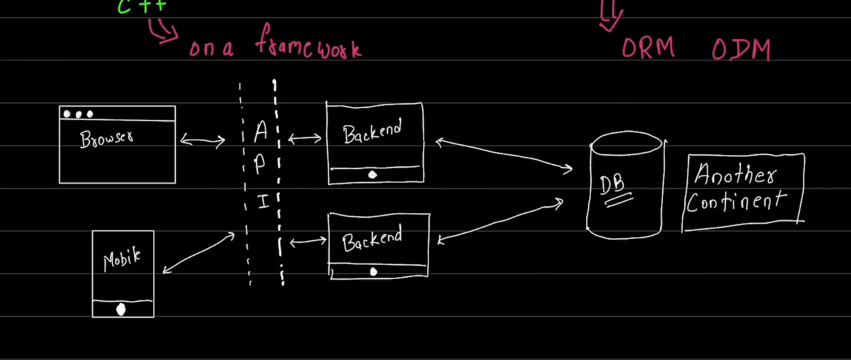
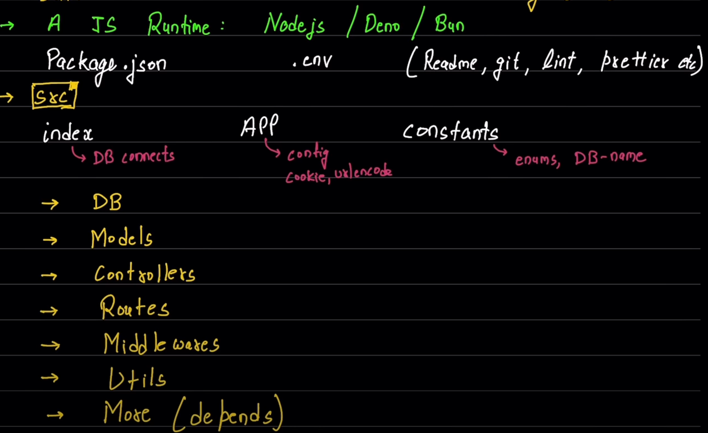
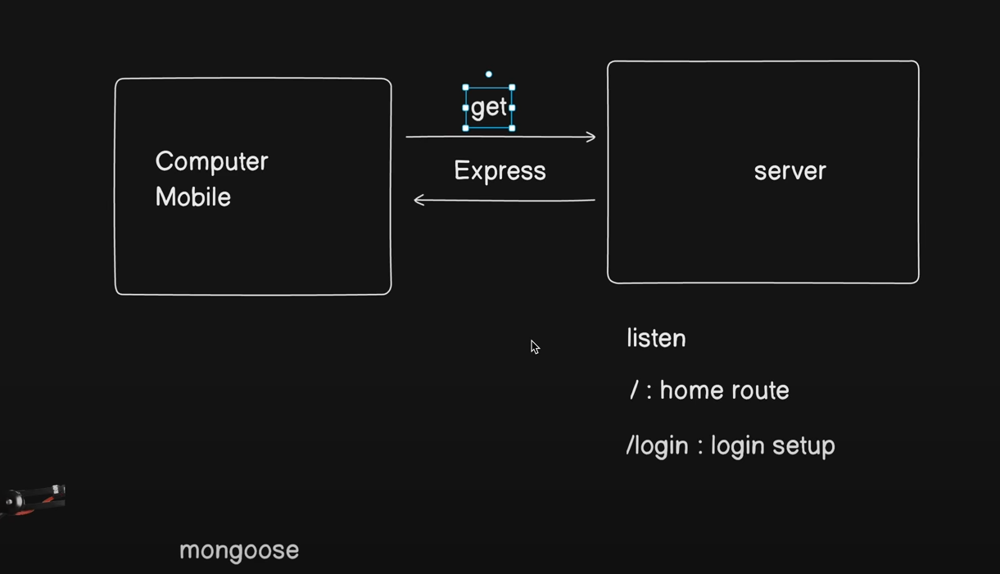

# Backend Concepts

# Components to focus on : 
- Programming language -> Java,JS, PHP, Golang, C++.
- Database -> Mongo, MySQL, Postgres, SqLite. {ORM,ODM} 

- API -> Application Programming Interface  (basically responses)
    - APIs are mechanisms that enable two software components to communicate with each other using a set of definitions and protocols
    - Example : the weather bureau’s software system contains daily weather data. The weather app on your phone “talks” to this system via APIs and shows you daily weather updates on your phone.

# Javascript based Backend
- things we'll be handling in JS based backend
    1) Data
    2) Files
    3) Third-party API's

- JS runtime environment : NodeJS / Bun / Deno
- it’s essential to maintain a well-structured codebase to ensure scalability, maintainability, and collaboration

# File directory structure :
    - Package.json , .env files, (Readme,git,lint,prettier)
    - Some important files
     1) index : db connect
     2) App : config,cookie,urlencode
     3) Constants : enums, db-name

- For reference (File directory) : https://medium.com/@datasciencenexus/how-to-structure-your-backend-code-in-node-js-c33a31fbf458

# Directory Structure
    1) DB : Database schema 
    2) Model : Defining Data Structures
    3) Controllers : Controllers are where the logic of your application resides (functions and methods) 
    4) Routes : Mapping the Streets and Highways
    5) Middleware : Helpers for Request Handling
    6) Utils : The utils directory is the home for utility functions that are used throughout your application. 
    7)  More (depends on the file system)

## Deploy backend code in Productions

 * Basic command : npm init -y (to init the node program)

 # Express:  Web framework
    Boiler plate code : 
    const express = require("express");
    const app = express();
    const PORT = 3000

    //Response object and Request object
    // testing the api endpoint 
    app.get("/", (req,res) => {
        res.json({
            message : "Api end points are working"
        });
    });

    //listenin to the server
    app.listen(PORT, function(req,res){
        console.log(`Server is runnin on ${PORT});
    });

# Notes: 
 - const express = require("express") : commmon JS type
 - export express from "express" : using Module types

# dotenv
    Dotenv is a zero-dependency module that loads environment variables from a .env file into process.env
    import 'dotenv/config'
